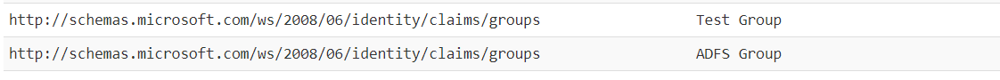

# Using on-prem AD Security Groups in Applications registered in an Microsoft Entra tenant

## Scenario

You have an AD FS application that uses on-prem Active Directory security groups, and you want that applications on your Microsoft Entra tenant can also work with the same groups.

### About the sample

This documentation guides you how to configure an Microsoft Entra application to include the security groups from an on-prem Active Directory.

### Prerequisites

- An Microsoft Entra (Microsoft Entra) tenant. For more information on how to get an Microsoft Entra tenant, see [How to get an Microsoft Entra tenant](https://docs.microsoft.com/azure/active-directory/develop/quickstart-create-new-tenant)
- [Microsoft Entra Connect](https://docs.microsoft.com/azure/active-directory/hybrid/how-to-connect-sync-whatis) configured on a domain-joined machine

## Migrate Security Groups

Users and groups will get synced to your Microsoft Entra tenant using the Microsoft Entra Connect tool out of the box, as long as they are presented in the **Synced OU** folder on the on-prem Active Directory.

If you haven't configured the Microsoft Entra Connect tool to sync security groups yet, refer to the [chapter 1-2](https://github.com/Azure-Samples/ms-identity-dotnet-adfs-to-aad/tree/master/1-ADFS-Host/1-2-Setup-AzureADConnect) once.

### Include Security Group as Claims in your application

1. Sign in to the [Azure portal](https://portal.azure.com).
2. Navigate to the Microsoft identity platform for developers [Enterprise applications](https://portal.azure.com/#blade/Microsoft_AAD_IAM/ActiveDirectoryMenuBlade/EnterpriseApps) page.
3. Search and select the application where you want to include Security Groups. For instance, `WebApp_SAML`.
4. Select **Single sign-on** on the left blade.
5. In the **User Attributes & Claims** section, select the **Edit** icon (a pencil) in the upper-right corner.
6. Select **Add a group claim**.
7. Choose the group to be returned in the claim, in this sample select **Security groups**.
8. For **Source attribute**, select the same option that you have chosen in the **Token configuration** blade.
9. Select **Save**.

### Test group claims in the application

Clean and build the solution. Run the Microsoft Entra integrated `WebApp_SAML` project, sign-in with a valid user, and the user's groups will be listed in the claims:

For each group that the user belongs to, a claim for it  will be displayed with the chosen **Source attribute** as its value.

> If you find a bug in the sample, raise the issue on [GitHub Issues](../../issues).

## We'd love your feedback!

Were we successful in addressing your learning objective? [Do consider taking a moment to share your experience with us.](https://forms.office.com/Pages/ResponsePage.aspx?id=v4j5cvGGr0GRqy180BHbR73pcsbpbxNJuZCMKN0lURpUODFCRVg4VTk2QUE2VEFPMUZKSEJNUFhWUyQlQCN0PWcu)

We're always listening, and if you want to get in touch with you directly, send an email to <aadappfeedback@microsoft.com>.

## Use Directory Extensions in Dynamic Groups

One of the most useful scenario in dynamic groups is the usage of Directory Extensions to dynamically associate users to it.

If you would like to configure dynamic groups, [follow this tutorial](https://docs.microsoft.com/azure/active-directory/hybrid/how-to-connect-sync-feature-directory-extensions#use-the-attributes-in-dynamic-groups).

## Next Step

- [Migrate an application using SAML protocol to OpenID Connect](../2-3-From-SAML-to-OIDC/README.md)

### Useful resources

- [Moving application authentication from AD FS to Microsoft Entra ID](https://docs.microsoft.com/azure/active-directory/manage-apps/migrate-adfs-apps-to-azure)
- [Configure SAML-based single sign-on to non-gallery applications](https://docs.microsoft.com/azure/active-directory/manage-apps/configure-single-sign-on-non-gallery-applications)
- [Synchronizing Directory Extensions to Microsoft Entra](https://docs.microsoft.com/azure/active-directory/hybrid/how-to-connect-sync-feature-directory-extensions)
- [Using Directory Extensions in Dynamic groups](https://docs.microsoft.com/azure/active-directory/hybrid/how-to-connect-sync-feature-directory-extensions#use-the-attributes-in-dynamic-groups)
